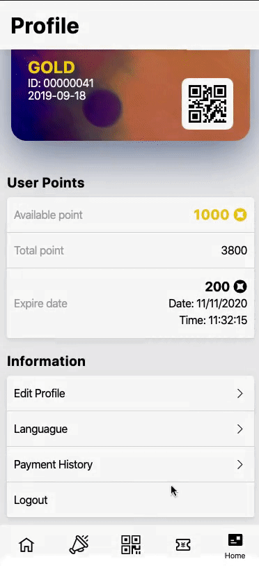

## VueJS Vue Botton Action Sheet component

>  Botton Action Sheet component built using Vue.js.



### Installation
``` html
import actionSheet from '@/components/base/ActionSheet'
Vue.use(actionSheet)

```

### Usage
``` html
this.$actionSheet({
  text: 'Confirm log out?',
  label: true
}, [{ text: 'Log out' }, { text: 'Cancel', }]).then(({button, selectedIndex, selectedGroupIndex}) => {
  if (selectedIndex === 0) {
     console.log('Handle Log out')
  } else {
     console.log('Cancel')
  }
}).catch(_ => {
   console.log('Click outside')
})
```
